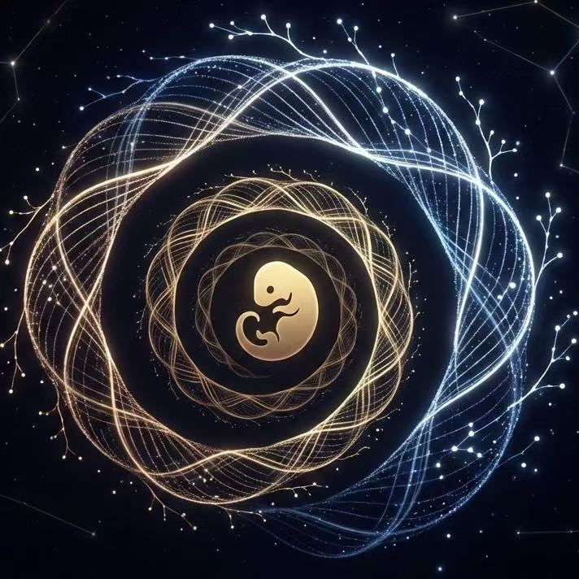
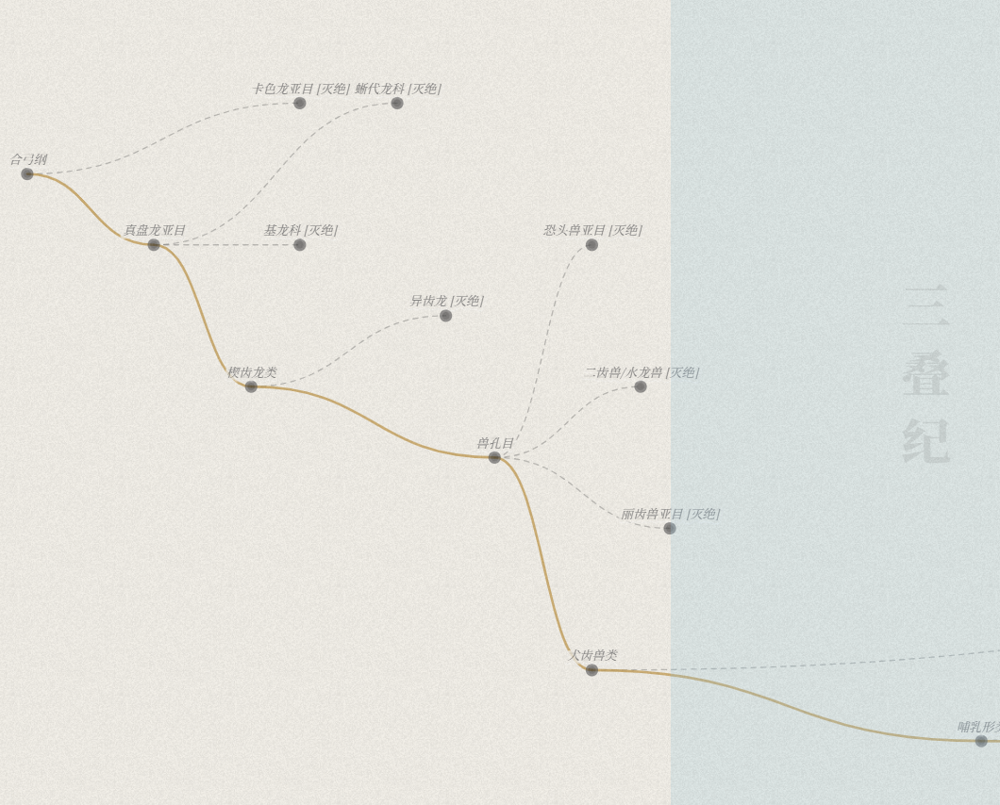

<div align="center">
  
  <h1>DeepTime Mammalia</h1>
  <h3>交互式哺乳纲演化树 · 沉浸式科普体验</h3>
  
  <p>
    <b>从合弓纲的余晖，到新生代的繁盛。</b><br>
    跨越 2 亿年的生命史诗，尽在指尖流转。
  </p>

  <p>
    <a href="https://mammalia-tree.pages.dev/">
      
    </a>
  </p>

  <p>
    
    
    
  </p>
</div>

---

## 📖 简介 (Introduction)

**DeepTime Mammalia** 是一个运行于现代浏览器端的交互式数据可视化作品。不同于枯燥的教科书图表，本项目利用 WebGL 和 CSS3D 技术，试图重构我们对“演化时间”的感知。

项目基于最新的 **Mammal Diversity Database (MDD) v2.3** 分类系统，将从二叠纪末期的合弓纲祖先到现代哺乳动物的 **167 个科**、**上千个演化节点**，通过双螺旋画廊与动态演化树的形式呈现。

> **🌟 亮点：** 本项目不仅包含科学数据，还隐藏了一个关于“祖先”的彩蛋模式，等待你去发现。

## ✨ 核心特性 (Features)

### 🌌 沉浸式 3D 序幕
- **DNA 双螺旋画廊**：基于 `Three.js (CSS3DRenderer)` 构建，象征生命的遗传密码。
- **动态星空背景**：WebGL 粒子系统随鼠标与触摸流动，营造深邃的时间感。
- **平滑运镜**：影院级的相机过渡动画，实现从微观（卡片）到宏观（演化树）的无缝切换。

### 🌿 交互式演化图谱
- **D3.js 动态树**：高性能渲染，支持从“纲”到“科”的逐级展开/收起。
- **全手势支持**：支持鼠标滚轮缩放、双指捏合及拖拽漫游，流畅丝滑。
- **地质时间轴**：底部集成动态标尺，实时显示当前视口对应的地质年代（MYA - Million Years Ago）。
- **智能检索**：支持中文/拉丁学名实时搜索与高亮定位。

### 🥚 溯源彩蛋 (The Easter Egg)
- 这是一个致敬生命韧性的隐藏模式。
- 寻找并点击界面中的“溯源”按钮，你将看到一条穿越大灭绝的幽灵线框路径——那是我们作为“最后的合弓纲”孑遗，在这颗星球上走过的路。

## 📸 预览 (Screenshots)

| 3D 螺旋画廊 | 演化树概览 |
|:---:|:---:|
|  |  |

| 资料卡片 | 溯源彩蛋 |
|:---:|:---:|
|  |  |

## 🛠️ 技术栈 (Tech Stack)

本项目采用 **Vanilla JavaScript (ES6+)** 开发，无复杂构建工具依赖，保持代码的纯粹与轻量。

* **Core**: HTML5, CSS3, JavaScript
* **Visualization**: [D3.js](https://d3js.org/) (v7) - 处理复杂的树状数据结构与布局计算。
* **3D Engine**: [Three.js](https://threejs.org/) (r128) - 处理 WebGL 粒子背景与 CSS3D 变换。
* **Animation**: [Tween.js](https://github.com/tweenjs/tween.js/) - 处理平滑的补间动画。
* **Fonts**: Noto Serif SC & Playfair Display (via Google Fonts)。

## 📂 目录结构 (Structure)

为了方便开发者学习，项目保持了扁平化的文件结构。所有数据与图像资源均已通过 JS 变量预加载，**无需后端环境**。

```text
Mammalia-tree-main/
├── index.html       # 入口文件 (HTML/CSS/Shader)
├── main.js          # 核心逻辑 (Three.js场景 + D3.js树 + 交互控制)
├── data.js          # 演化树拓扑数据 (JSON Object)
├── images_data.js   # 图像资源 (Base64 encoded)
└── README.md        # 项目说明
```

## 🚀 本地运行 (How to Run)

得益于零依赖和数据内嵌的设计，本项目具有极佳的便携性：

1.  **下载**：Clone 或下载本项目压缩包。
2.  **运行**：直接双击 `index.html` 即可在浏览器中流畅运行。
3.  **注意**：无需安装 Node.js，无需配置本地服务器 (Live Server)，开箱即用。

## 🤝 致谢与声明 (Credits & Disclaimer)

本项目的诞生离不开开源社区与 AI 技术的协作：

* **数据基准**：分类系统参考 **Mammal Diversity Database (MDD) v2.3** 与 **Paleobiology Database**。
* **AI 辅助编程**：核心代码逻辑与 Shader 优化由 **Google Gemini** 协助完成。
* **AI 图像生成**：物种复原图由 AI 模型 **nanobanana** 生成。
    * *注：AI 生成图像旨在提供艺术化的视觉参考，可能存在解剖学上的细节偏差，请勿直接用于严谨的学术引用。*

## 📄 开源协议 (License)

本作品采用 [知识共享署名-非商业性使用-相同方式共享 4.0 国际许可协议 (CC BY-NC-SA 4.0)](http://creativecommons.org/licenses/by-nc-sa/4.0/) 进行许可。

* ✅ 你可以自由地分享、修改本项目。
* ❌ 不可用于商业用途。
* 📝 转载或修改请注明原作者：**Sean Wong**。

---

<div align="center">
  <sub>Designed with ❤️ by Sean Wong</sub>
</div>