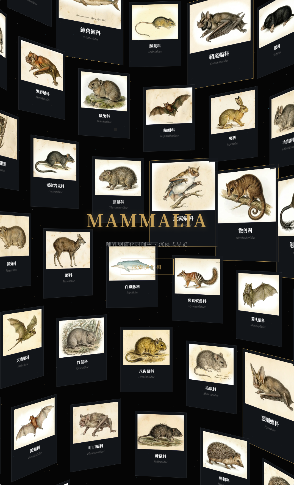
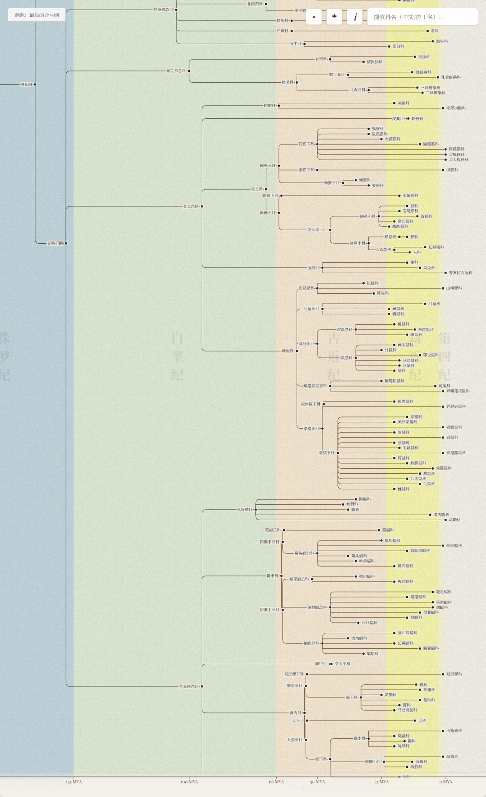
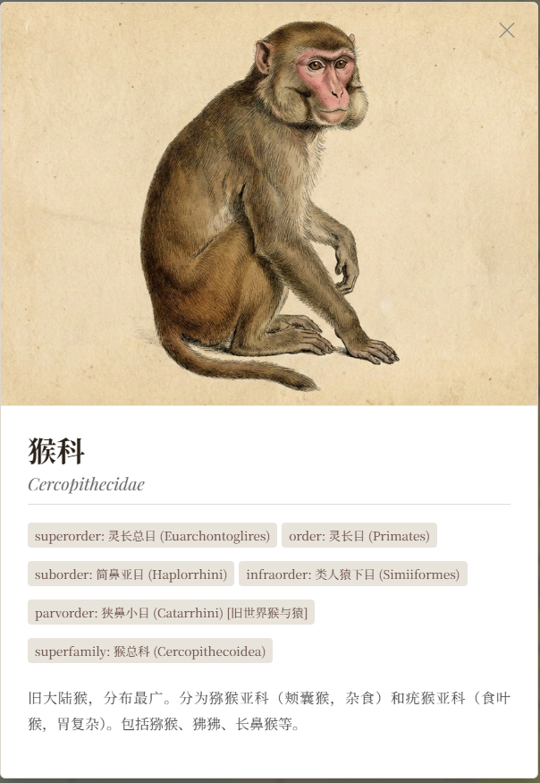

# DeepTime Mammalia: 交互式哺乳纲演化树

> **从合弓纲的余晖，到新生代的繁盛。** > 一个沉浸式的 3D/2D 网页可视化项目，探索哺乳动物 2 亿年的演化史诗。


## 📖 项目简介 (Introduction)

**DeepTime Mammalia** 是一个运行于现代浏览器端的交互式数据可视化作品。它旨在通过直观、美观且具有沉浸感的交互方式，展示从合弓纲（Synapsida）祖先到现代哺乳动物（Mammalia）的复杂演化分支。

不同于传统的枯燥图表，本项目结合了 WebGL 粒子特效、CSS3D 螺旋展示以及 D3.js 动态演化树，为用户提供了一场穿越地质年代的视觉之旅。

主要数据基于最新的 **Mammal Diversity Database (MDD) v2.3**，时间标尺校准至冠群（Crown Group）分化时间。

## ✨ 核心特性 (Features)

### 1. 沉浸式开场 (The Helix Intro)
- **3D 螺旋画廊**：使用 `Three.js (CSS3DRenderer)` 构建的双螺旋结构，动态展示精选物种卡片。
- **星空粒子背景**：基于 WebGL 的动态粒子系统，随鼠标/触摸交互流动，营造深邃的历史感。
- **平滑转场**：从 3D 空间无缝过渡到 2D 平面视图。

### 2. 交互式演化树 (The Phylogeny Tree)
- **动态树状图**：基于 `D3.js` 的高性能渲染，支持上千个节点的流畅展示。
- **全手势支持**：
  - **缩放/平移**：支持鼠标滚轮、双指缩放及拖拽漫游。
  - **折叠/展开**：点击节点即可逐级展开或收起演化分支，支持“一键展开/收起”所有层级。
- **地质时间轴**：底部集成动态时间轴，实时显示当前视图对应的地质年代（从三叠纪到第四纪）。
- **智能搜索**：支持中文/拉丁学名搜索，自动定位并高亮显示目标物种位置。

### 3. 详细资料卡片 (Specimen Modal)
- 点击任意物种名称，弹出详细资料模态框。
- 包含分类阶元信息（界门纲目科）、物种复原图及详细描述。

### 4. 溯源彩蛋 (The Origin Easter Egg)
- 隐藏的“溯源模式”，展示哺乳动物作为“最后的合弓纲”孑遗的演化路径。
- 独特的视觉风格（幽灵线框风格），致敬那些在二叠纪-三叠纪灭绝事件中消失的先祖。

## 📷 效果演示 (Screenshots)

### 🌌 3D 螺旋画廊


### 🌿 演化树视图


### 📱 移动端与资料卡片



## 🛠️ 技术栈 (Tech Stack)

本项目采用原生 JavaScript (ES6+) 开发，无大型构建工具依赖，轻量且易于部署。

- **核心逻辑**: Vanilla JavaScript
- **2D 可视化**: [D3.js](https://d3js.org/) (v7) - 处理树状数据结构与布局。
- **3D 渲染**: [Three.js](https://threejs.org/) (r128) - 处理 WebGL 粒子与 CSS3D 变换。
- **动画引擎**: [Tween.js](https://github.com/tweenjs/tween.js/) - 处理相机运镜与过渡动画。
- **字体**: Noto Serif SC & Playfair Display (Google Fonts / Loli.net 镜像)。


## 🚀 部署与运行 (Deployment)

本项目为纯静态项目（Static Site），支持“一键部署”。

### 推荐部署方案

1.  **Cloudflare Pages (推荐)**
    - 将本项目 Fork 到你的 GitHub。
    - 在 Cloudflare Pages 中连接仓库，设置根目录为项目根目录。
    - 自动部署，国内访问速度较快。

2.  **本地运行**
    由于浏览器的 CORS 安全策略，直接双击打开 `index.html` 可能导致数据加载失败。建议使用本地服务器：
    ```bash
    # 使用 Python
    python -m http.server 8000
    
    # 或者使用 Node.js http-server
    npx http-server
    ```
    然后在浏览器访问 `http://localhost:8000`。

    或者访问在线演示：[Live Demo](https://mammalia-tree.pages.dev/)
    备用地址：[Live Demo2](https://seanwong17.github.io/Mammalia-tree/)

## 📂 数据与素材说明 (Credits)

本项目的制作离不开开源社区与 AI 技术的支持：

- **数据来源**：
  - 分类系统参考：**Mammal Diversity Database (MDD) v2.3**
  - 古生物数据交叉验证：**Paleobiology Database**
- **图像资源**：
  - 所有物种复原图均由 AI 模型 **nanobanana** 生成。
  - *注：AI 生成图像可能存在解剖学上的不准确或艺术化夸张，仅供视觉参考，严禁用于严谨的学术论文配图。*
- **特别鸣谢**：
  - 代码协助与技术支持：**Google Gemini**


## ⚠️ 版权与许可 (License)

本作品采用 [知识共享署名-非商业性使用-相同方式共享 4.0 国际许可协议](http://creativecommons.org/licenses/by-nc-sa/4.0/) 进行许可。

[](http://creativecommons.org/licenses/by-nc-sa/4.0/)

This work is licensed under a [Creative Commons Attribution-NonCommercial-ShareAlike 4.0 International License](http://creativecommons.org/licenses/by-nc-sa/4.0/).

