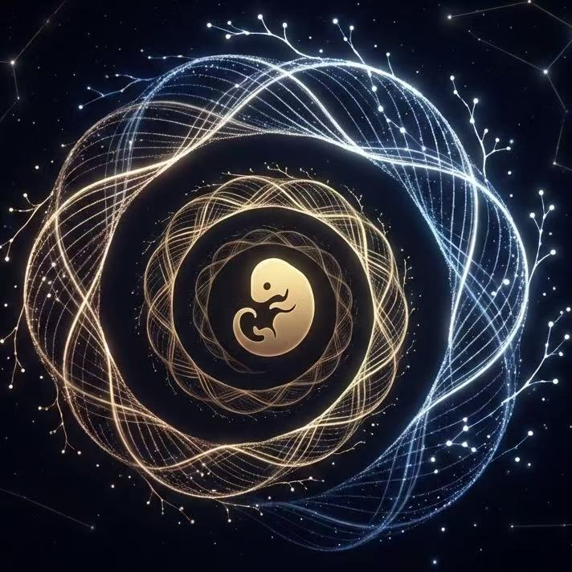
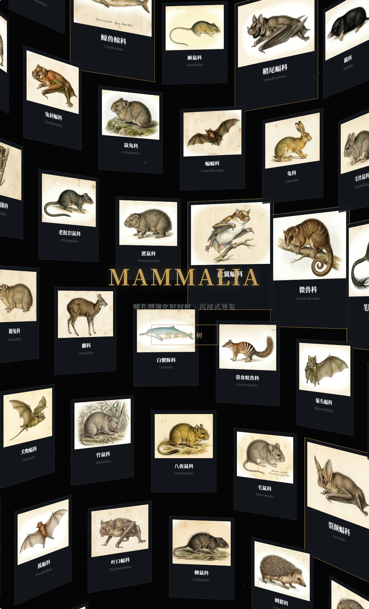
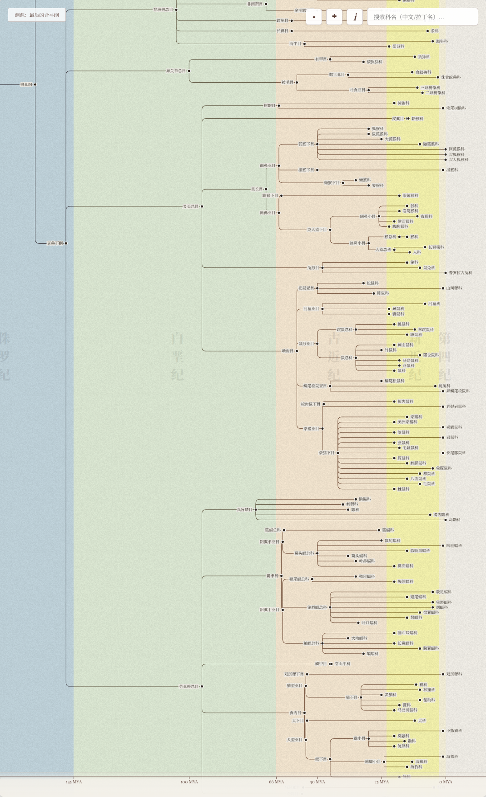
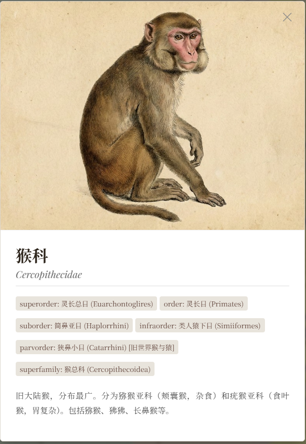
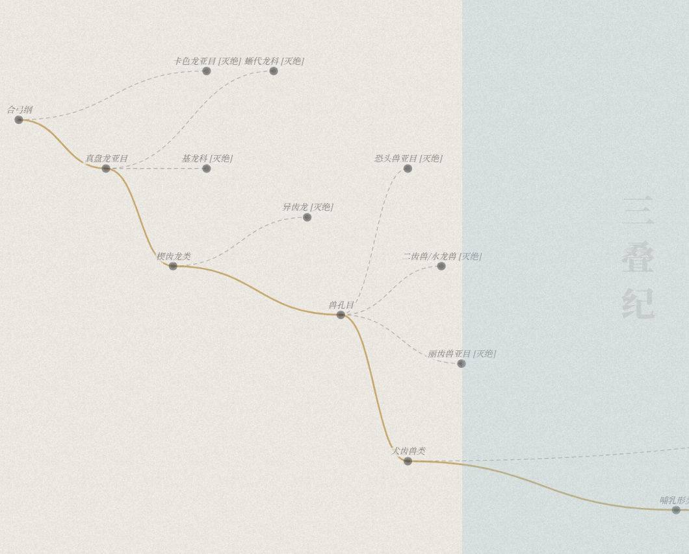

<div align="center">
  
  <h1>DeepTime Mammalia</h1>
  <h3>Interactive Phylogenetic Tree of Mammals · Immersive Experience</h3>

  <p>
    <b>From the embers of Synapsids to the flourishing Cenozoic.</b><br>
    A 200-million-year epic of life, flowing at your fingertips.
  </p>

  <p>
    <a href="README.md">中文</a> | <b>English</b>
  </p>

  <p>
    <a href="https://mammalia-tree.pages.dev/">
      
    </a>
  </p>

<p>
  <a href="https://github.com/ruanyf/weekly/blob/master/docs/issue-381.md">
    
  </a>
  
  
  
</p>
</div>

---

> **🌍 Full Chordate Atlas:** Continue from mammals into fishes, amphibians, sauropsids, and birds in [DeepTime Chordata](https://github.com/SeanWong17/Chordata-atlas).

## 📖 Introduction

**DeepTime Mammalia** is an interactive data visualization project running in modern browsers. Unlike dry textbook charts, this project leverages WebGL and CSS3D technologies to reconstruct our perception of "Deep Time" and evolution.

Based on the latest **Mammal Diversity Database (MDD) v2.3**, it presents the complex evolutionary branches—from the Synapsid ancestors of the late Permian to modern mammals (167 families, over a thousand nodes)—through a 3D double-helix gallery and a dynamic phylogenetic tree.

> **🌟 Highlight:** This project contains not only scientific data but also a hidden "Easter Egg" mode about our ancestors, waiting for you to discover.

## 🧭 Related Project

If you want to continue along the other major amniote branch, take a look at the sister project **DeepTime Sauropsida**. It focuses on birds, crocodilians, turtles, tuataras, and squamates, placing living sauropsids back into roughly 300 million years of deep-time context.

👉 GitHub: <https://github.com/SeanWong17/Sauropsida-tree>

## ✨ Features

### 🌌 Immersive 3D Prologue
- **DNA Helix Gallery**: Built with `Three.js (CSS3DRenderer)`, symbolizing the genetic code of life.
- **Dynamic Starfield**: A WebGL particle system that flows with mouse and touch interactions, creating a sense of profound time.
- **Cinematic Transitions**: Smooth camera movements seamlessly transition from the micro view (cards) to the macro view (phylogenetic tree).

### 🌿 Interactive Phylogeny
- **Dynamic D3.js Tree**: High-performance rendering supporting the expansion/collapse of branches from "Class" down to "Family" level.
- **Full Gesture Support**: Smooth mouse wheel zooming, pinch-to-zoom, and drag panning. Optimized for mobile devices.
- **Geological Timeline**: An integrated dynamic ruler at the bottom displays the geological epoch corresponding to the current viewport (MYA - Million Years Ago).
- **Smart Search**: Supports real-time search and highlighting by Latin scientific names or Chinese names.

### 🌐 Internationalization
- **Language Toggle**: One-click switch between Chinese and English interface.
- **Smart Text Adaptation**: Node names, descriptions, and UI elements automatically adapt to the current language.

### 🥚 The Origin Easter Egg
- A hidden mode paying tribute to the resilience of life.
- Find and click the "Origin" (溯源) button to reveal a ghostly wireframe path crossing the great extinctions—the path we walked as the last survivors of the Synapsids.

### ⚡ Performance Optimization
- **Responsive Design**: Automatically adapts to desktop and mobile devices with optimized display.
- **Dynamic Resource Loading**: Adjusts particle count and rendering quality based on device performance.
- **Modular Architecture**: Clean code separation for easy maintenance and secondary development.

## 📸 Screenshots

| 3D Helix Gallery | Tree Overview |
|:---:|:---:|
|  |  |

| Specimen Card | Origin Easter Egg (Ghost View) |
|:---:|:---:|
|  |  |

## 🛠️ Tech Stack

This project uses **Vanilla JavaScript (ES6+)** with no runtime build step. Third-party browser dependencies are version-locked and self-hosted.

* **Core**: HTML5, CSS3, JavaScript
* **Visualization**: [D3.js](https://d3js.org/) (v7) - Handles complex tree data structures and layout calculations.
* **3D Engine**: [Three.js](https://threejs.org/) (r128) - Handles WebGL particle backgrounds and CSS3D transformations.
* **Animation**: [Tween.js](https://github.com/tweenjs/tween.js/) - Handles smooth interpolation animations.
* **Fonts**: Self-hosted, unicode-range-split Noto Serif SC with no external font requests.

## 📂 Structure

The project adopts a modular design for easy maintenance and extension. Images are independent, content-hashed WebP assets loaded on demand, requiring **no backend environment**.

```text
Mammalia-tree-main/
├── assets/                  # Static assets
│   ├── images/             # 167 on-demand WebP images
│   └── logo.png            # Project Logo
├── data/                    # Data files
│   ├── data.js             # Phylogenetic topology data (JSON Object)
│   └── images_manifest.js  # Content-hashed image manifest
├── examples/                # Screenshots for README
├── src/                     # Source code
│   ├── css/
│   │   └── style.css       # Main stylesheet
│   └── js/
│       ├── config.js       # Global configuration (performance, layout, etc.)
│       ├── i18n.js         # Internationalization (Chinese/English)
│       ├── utils.js        # Utility functions
│       ├── easter_egg_data.js  # Easter egg data
│       ├── gallery.js      # WebGL and CSS3D gallery
│       ├── tree.js         # D3 evolution tree
│       └── app.js          # Lifecycle and UI controller
├── scripts/                 # Validation, vendoring, and dev server
├── tests/                   # Node.js and Playwright regression tests
├── vendor/                  # Version-locked browser dependencies
├── index.html               # Entry point
├── package.json             # Development and test commands
├── README.md                # Chinese Documentation
└── README_EN.md             # English Documentation
```

## 🚀 How to Run

All runtime resources are local static files, so the project supports both direct preview and an included development server:

### Method 1: Direct Open (Recommended for Quick Preview)
1.  **Download**: Clone or download the repository.
2.  **Run**: Simply double-click `index.html` to run smoothly in your browser.
3.  **Note**: No Node.js installation required, no local server configuration needed.

### Method 2: Local Server (Recommended for Development)

```bash
npm install
npm start
```

Then visit `http://127.0.0.1:4173`. Before committing, run `npm run check` and `npm run test:browser`.

## 🔧 Customization

The project supports customization through `src/js/config.js`:

```javascript
// Performance configuration
performance: {
    particleCount: { desktop: 2000, mobile: 1000 },  // Particle count
    cardCount: { base: 30, min: 35, max: 80 }        // Card count
}

// 3D scene configuration
scene3D: {
    helix: { radiusBase: 600, yStep: 30 },           // Helix radius and spacing
    camera: { targetZDesktop: 2000 }                 // Camera position
}

// Tree configuration
tree: {
    width: { desktop: 2000, mobile: 1200 },          // Tree width
    nodeSpacing: 45,                                 // Node spacing
    zoom: { scaleExtent: [0.15, 3] }                 // Zoom range
}
```

## 🤝 Credits & Disclaimer

The birth of this project relied on collaboration between the open-source community and AI technology:

* **Data Basis**: Taxonomy based on **Mammal Diversity Database (MDD) v2.3** and **Paleobiology Database**.
* **AI Assistance**: Core code logic and Shader optimization assisted by **Google Gemini**.
* **AI Image Generation**: Specimen restoration images generated by the AI model **nanobanana**.
    * *Note: AI-generated images are intended for artistic visual reference and may contain anatomical inaccuracies. Please do not use them for rigorous academic citations.*

## 📄 License

This work is licensed under the [Creative Commons Attribution-NonCommercial-ShareAlike 4.0 International License (CC BY-NC-SA 4.0)](LICENSE).

* ✅ You are free to share and adapt this project.
* ❌ Commercial use is prohibited.
* 📝 Please attribute the original author: **Sean Wong**.

## 📈 Star History

[](https://star-history.com/#SeanWong17/Mammalia-tree&Date)

---

<div align="center">
  <sub>Designed with ❤️ by Sean Wong</sub>
</div>
